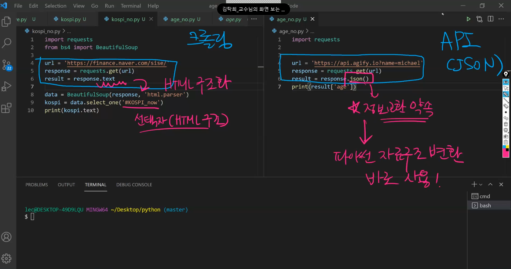
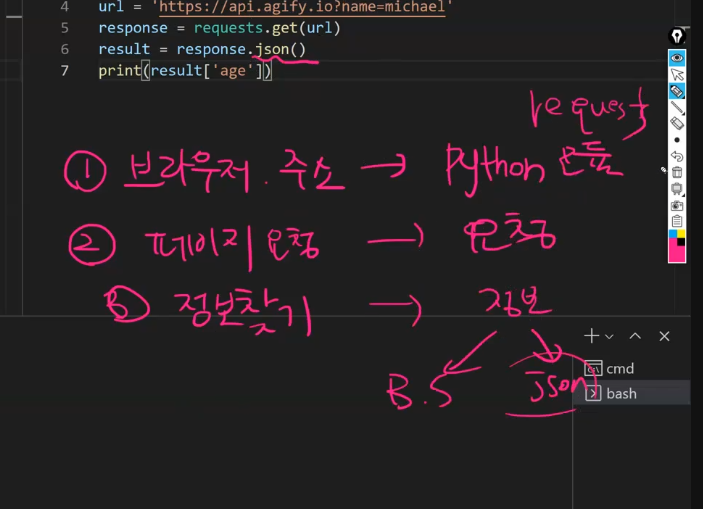

# python 크롤링 & API

### 1. 크롤링

> 브라우저를 통해 사용하던 웹 문서를 파이썬으로 요청
>
> BeautifulSoup으로 웹 문서 구조형태로 변형
>
> 선택자를 활용하여 원하는 데이터 활용

* 정보 스크랩

```python
# 0. requests 패1키지를 가져온다.
import requests
from bs4 import BeautifulSoup

# 1. url을 준비한다.
url = 'https://finance.naver.com/sise/'
# 2. 파이썬으로 요청을 보낸 결과를 저장
response = requests.get(url).text
# 3. 정보 추출을 위해서, BeautifulSoup으로 문서 구조화
# -> html으로 구조화
data = BeautifulSoup(response, 'html.parser')
# 4. 선택자를 활용해서 해당 위치를 찾고
kospi = data.select_one('#KOSPI_now')
# 5. 내용을 출력한다.
print(kospi.text)
```

`BeautifulSoup(문서)` : 문서를 보기 좋게 만들기
`.select(selector)` : 특정내용을 뽑아줘
`.select_one(selector)` : 특정내용을 하나만 뽑아줘


* string-interpolation (문자열 보관법)

`f-string` : 문자열 사이에 변수 값을 넣는 방법


### 2. API 

>  데이터를 교환하기 위한 JSON 파일을 파이썬으로 요청
>
> JSON을 쉽게 파이썬 문법으로 변형
>
> 데이터 구조를 활용하여 원하는 데이터 활용(나중에는 요청을 통해 특정 기능을 제어하기도 한다.)

```python
import requests

url = 'https://api.agify.io/?name=sohee'
response = requests.get(url)
result = response.json()
print(result)
print(type(result))
print(result['age'])
```

* 응용

```python
import requests

names = ['tak', 'tony', 'eric', 'musk']

for name in names:
    url = f'https://api.agify.io/?name={name}'
    response = requests.get(url)
    result = response.json()
    print(result)
    print(result['age'])
    
```

```python
import requests

url = 'https://api.nationalize.io/?name=michael'
response = requests.get(url)
result = response.json()
print(result['country'][0]['country_id'])
```


* 크롤링과 API의 차이





